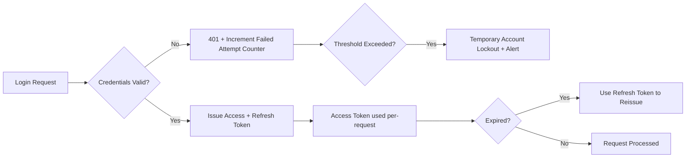

# MedAssist AI — Security Architecture

Health data is highly sensitive; this document defines the baseline security controls required before production launch. Final regulatory certification (HIPAA, GDPR, local health-data laws depending on deployment region) requires legal/compliance review in addition to these engineering controls.

---

## 1. Authentication

- **JWT-based authentication**: short-lived access tokens (15 min) + longer-lived refresh tokens (7 days), refresh tokens stored hashed and revocable server-side.
- **Password storage**: Argon2id (preferred) or bcrypt with per-user salt; never store or log plaintext passwords.
- **OTP verification**: required for registration and available as a login MFA option; OTPs expire in 5 minutes and are single-use.
- **Doctor/Admin accounts**: not self-service — created via an admin-controlled onboarding flow with license-number verification for doctors.
- **Session invalidation**: on password change, logout, or suspicious activity, all active refresh tokens for the user are revoked (Redis-backed token blacklist).

## 2. Role-Based Access Control (RBAC)

| Role | Access Scope |
|---|---|
| Patient | Own profile, own reports, own predictions, own chat sessions |
| Doctor | Own profile + assigned patients' reports/history/predictions (assignment verified per-request, not just per-session) |
| Admin | User/doctor management, platform analytics, AI monitoring — **no direct access to individual patient clinical detail without an explicit, logged support-access justification** |

- Enforced at the **service layer** (not just router-level) — every repository call that touches PHI checks the requester's role and relationship to the resource (e.g., "is this doctor actually assigned to this patient") before returning data.
- Principle of least privilege: admin role is deliberately restricted from routine clinical data access to minimize PHI exposure surface; any admin "impersonation" or support access to patient data requires a break-glass procedure that is fully audit-logged.

## 3. Encryption

| Data state | Control |
|---|---|
| In transit | TLS 1.2+ enforced everywhere (client↔Nginx, Nginx↔backend, backend↔AI services, backend↔DB) |
| At rest — Database | PostgreSQL encryption at rest (e.g., RDS storage encryption via AWS KMS) |
| At rest — File storage | S3 server-side encryption (SSE-KMS) for uploaded medical reports |
| At rest — Backups | Encrypted backups with restricted access, separate key from primary data encryption |
| Application-level | Sensitive fields (e.g., license numbers) additionally encrypted at the application layer where regulatory guidance recommends field-level encryption beyond storage-level encryption |

## 4. Rate Limiting & Abuse Prevention

- Redis-backed token-bucket rate limiting per user and per IP at the Nginx/gateway layer.
- Stricter limits on AI inference endpoints (cost + abuse prevention) and chatbot messaging (prevent prompt-injection spam / resource exhaustion).
- Login endpoint: exponential backoff + temporary lockout after repeated failures; CAPTCHA challenge after threshold.
- File upload endpoint: file-size limits, MIME-type whitelist, and malware/antivirus scanning before persisting to storage.

## 5. Audit Logging

- Every access to PHI-bearing resources (reports, predictions, prescriptions, patient history) is written to the `AUDIT_LOGS` table: `user_id`, `action`, `resource_type`, `resource_id`, `metadata` (e.g., IP, user agent), `created_at`.
- Audit logs are append-only (no update/delete permissions at the application layer) and retained per the data-retention policy (see Database Design doc).
- Admin actions on user/doctor accounts (suspend, delete, role change) are always audit-logged with the acting admin's identity.
- AI predictions log the model version used (`AI_MODELS.id`) alongside the prediction, ensuring every clinical-adjacent output is fully traceable to the exact model that produced it.

## 6. Medical Data Security (PHI-specific Controls)

- **Data minimization**: AI services receive only the fields required for a given prediction (e.g., the diabetes model does not receive the patient's full medical history, only the relevant structured clinical inputs).
- **De-identification for model training**: any patient data used to retrain/improve production models is de-identified (direct identifiers stripped) and used only under documented consent terms.
- **Consent tracking**: patient consent for data usage (AI processing, potential research/model-improvement use) is captured and stored, with the ability for patients to view/revoke consent.
- **Data residency**: object storage and databases deployed in a region consistent with applicable data-residency requirements for the target market; OCR/LLM services preferentially self-hosted or run via a data-processing agreement with the vendor rather than sending PHI to a service without a BAA-equivalent agreement.
- **Right to access/delete**: backend exposes admin-assisted patient data export and deletion workflows to support data-subject rights requests.

## 7. Network & Infrastructure Security

- Backend and AI services deployed in a private subnet, not directly internet-addressable; only the load balancer/Nginx sits in the public subnet.
- Database and Redis are not publicly accessible; security groups restrict access to the application subnet only.
- Secrets (DB credentials, JWT signing keys, API keys) managed via a secrets manager (e.g., AWS Secrets Manager), never committed to source control or baked into container images.
- Dependency and container image scanning integrated into CI/CD (see Development Roadmap / CI-CD pipeline) to catch known vulnerabilities before deployment.

## 8. Security Testing & Ongoing Assurance

- Static Application Security Testing (SAST) and dependency vulnerability scanning run in CI on every PR.
- Periodic penetration testing before major releases and at a minimum annual cadence post-launch.
- Incident response runbook defined for PHI-exposure scenarios, including notification obligations under applicable law.
