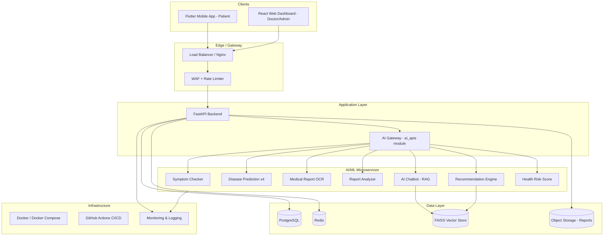
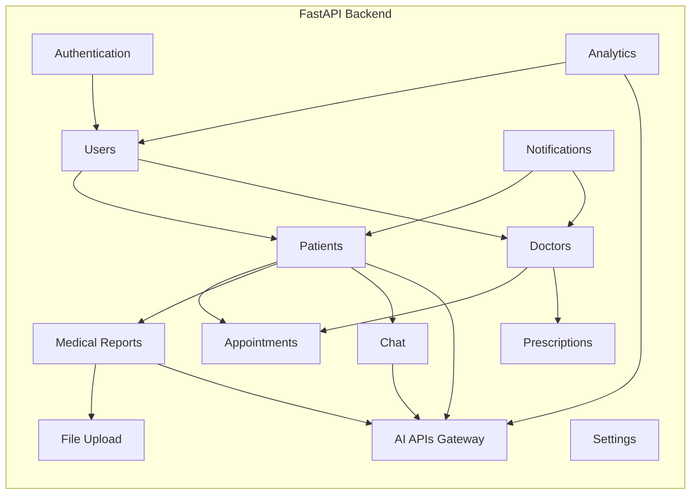
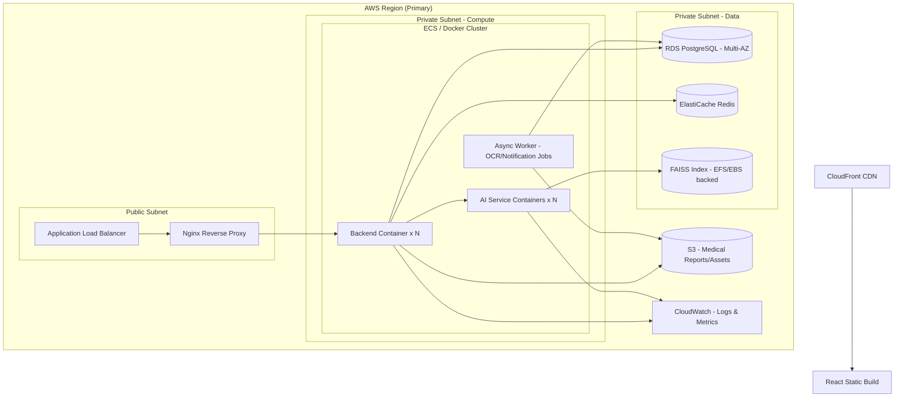
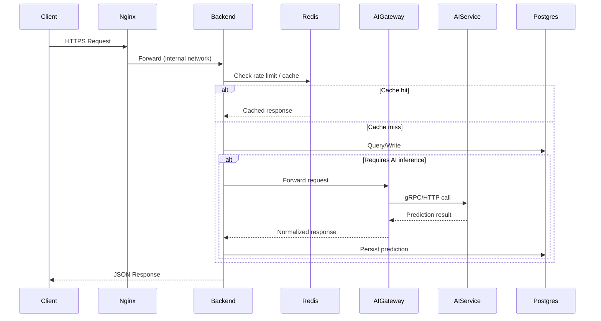

# MedAssist AI — System Architecture

## 1. High-Level Architecture

**Rationale:** The AI Gateway (`ai_apis` backend module) acts as an anti-corruption layer between the core backend and the AI microservices — the backend never calls AI models directly, so AI services can be scaled, versioned, or replaced without touching backend business logic. This also centralizes AI request logging, rate limiting, and response normalization in one place.

---

## 2. Component Diagram

Each block corresponds directly to a backend module (`app/modules/<name>`) following the router → service → repository → model layering defined in the Folder Structure document.

---

## 3. Deployment Diagram

**Notes:**
- Backend and AI services run as separate container groups so each can be scaled independently based on load (AI inference is typically more CPU/GPU-intensive than CRUD API traffic).
- `WORKER` handles asynchronous, longer-running jobs (OCR processing, notification dispatch) via a Redis-backed queue (Celery/RQ), keeping the main API responsive.
- Multi-AZ RDS for PostgreSQL provides high availability; Redis via managed ElastiCache for session/cache reliability.

---

## 4. Microservice Boundaries

| Service | Responsibility | Scaling driver |
|---|---|---|
| Core Backend (FastAPI) | Auth, CRUD, orchestration, business rules | Request volume (CPU) |
| AI Gateway | Routes/normalizes calls to AI services, applies AI-specific rate limits | Request volume |
| Symptom Checker Service | NLP inference | Inference load (CPU/GPU) |
| Disease Prediction Services (x4) | Tabular ML inference | Inference load (CPU) |
| OCR Service | Document processing | Job queue depth (CPU/GPU, batch-friendly) |
| Report Analyzer Service | Rule engine + LLM summarization | Inference load (CPU/GPU) |
| Chatbot Service | RAG retrieval + LLM generation | Concurrent sessions (CPU/GPU + memory for vector index) |
| Recommendation Engine | Rule + similarity search | Low — lightweight, CPU only |
| Health Risk Score Service | Aggregation of other model outputs | Low — depends on upstream services |
| Async Worker | OCR jobs, notifications | Queue depth |

Each AI service is independently containerized (own Dockerfile, own `requirements`) which directly maps to the `ai-services/<module>/` folder structure — enabling independent deployment pipelines per module (see CI/CD in Deployment Guide).

---

## 5. Communication & Data Flow

- **Synchronous** communication (HTTP/REST or gRPC) is used between Backend ↔ AI Gateway ↔ AI Services for real-time predictions (symptom checker, disease prediction, chatbot).
- **Asynchronous** communication (Redis-backed queue) is used for OCR processing and notification dispatch, since these are not required to complete within the request/response cycle.

---

## 6. Why Microservices for AI, Modular Monolith for Backend

- The **core backend** is deployed as a modular monolith (single FastAPI app, internally organized into clean modules) rather than full microservices — at MedAssist AI's expected scale, this reduces operational overhead (one deployment, one DB connection pool to manage) while the clean module boundaries (`router/service/repository`) keep the code ready to be split into true microservices later if a specific module's load justifies it.
- The **AI layer** is microservices from day one because: (a) AI workloads have fundamentally different resource profiles (GPU vs CPU, batch vs real-time) than CRUD workloads, (b) AI models are retrained/redeployed on independent cadences, and (c) isolating AI services limits the blast radius if a specific model misbehaves or needs rollback.
