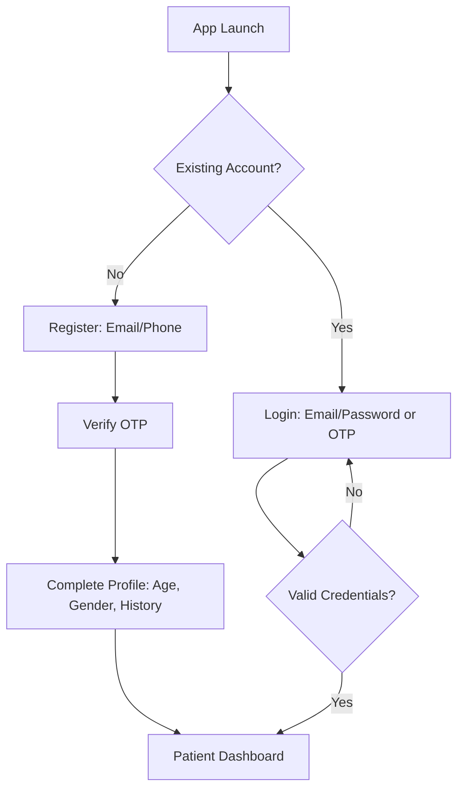
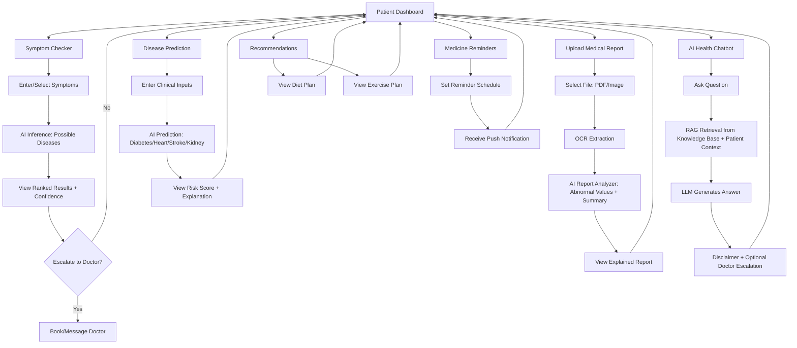
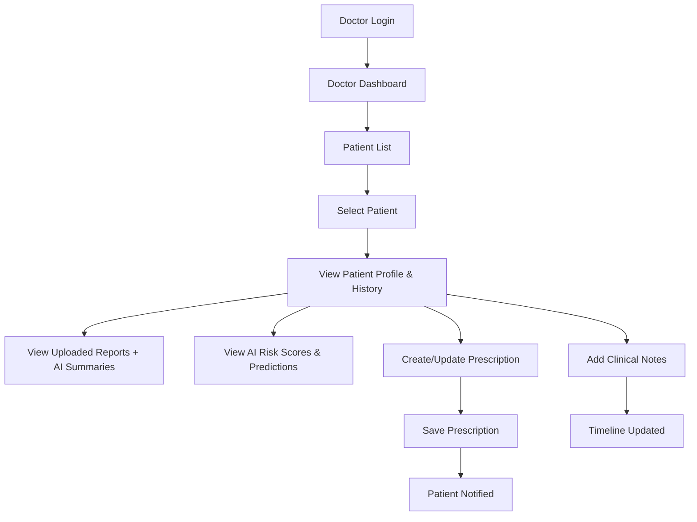
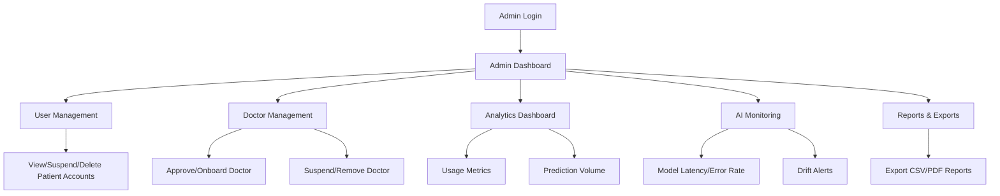
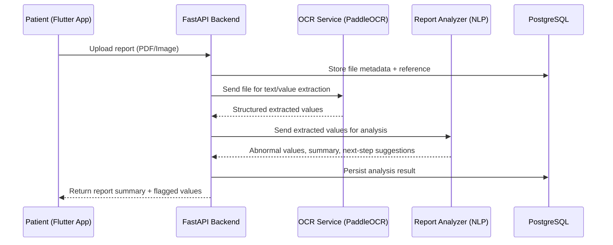
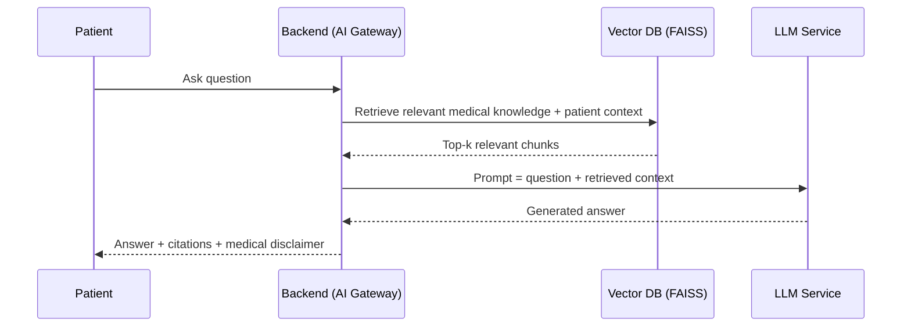

# MedAssist AI — User Flows

Flows are represented as Mermaid diagrams for direct rendering in GitHub/GitLab markdown.

---

## 1. Patient User Flow

### 1.1 Onboarding & Authentication

### 1.2 Core Patient Journey

---

## 2. Doctor User Flow

---

## 3. Admin User Flow

---

## 4. Cross-Cutting Flow: Medical Report Lifecycle

---

## 5. Cross-Cutting Flow: AI Chatbot (RAG)

