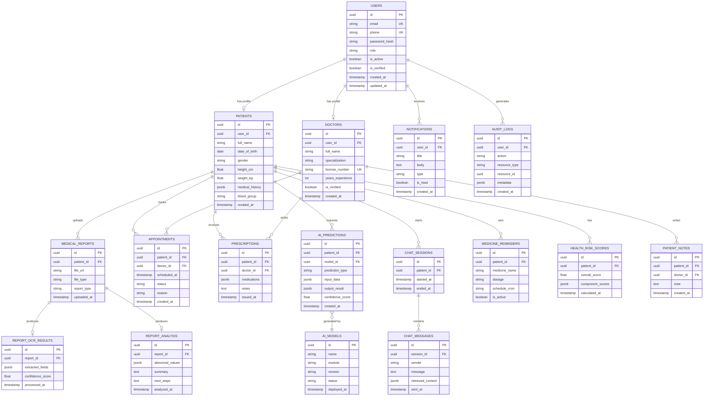

# MedAssist AI — Database Design

Target: PostgreSQL (primary relational store), Redis (cache/session/rate-limit).
Design follows Third Normal Form (3NF) with selective denormalization for read-heavy analytics tables.

---

## 1. Entity-Relationship Diagram

---

## 2. Table Notes & Normalization Rationale

- **USERS** is the single source of truth for authentication; **PATIENTS** and **DOCTORS** are 1:1 profile extensions (role-specific attributes), avoiding a wide, sparse `users` table (3NF).
- **MEDICAL_REPORTS → REPORT_OCR_RESULTS → REPORT_ANALYSIS** is intentionally split into three tables reflecting the processing pipeline stages, enabling reprocessing/versioning of OCR or analysis independently without touching the raw report record.
- **AI_PREDICTIONS** is a generic table for all prediction modules (`prediction_type` discriminates: `symptom_checker`, `diabetes`, `heart_disease`, `stroke`, `kidney_disease`, `health_risk_score`), rather than one table per disease — reduces schema sprawl as new AI modules are added and simplifies analytics queries across all predictions.
- **AI_MODELS** tracks deployed model versions referenced by `AI_PREDICTIONS.model_id`, enabling full traceability of which model version produced a given result (required for auditability and rollback).
- **jsonb** columns (`medical_history`, `input_data`, `output_result`, `extracted_fields`, `component_scores`) are used deliberately for semi-structured, evolving AI/clinical payloads where a rigid relational schema would require frequent migrations; core identifying/queryable fields remain relational columns.
- **AUDIT_LOGS** captures every access/action on PHI-adjacent resources — required for compliance and security review (see Security Architecture doc).
- **Redis** is used for: session/token blacklists, rate-limiting counters, caching frequent read queries (e.g., doctor dashboard aggregates), and as a short-lived queue for async OCR/analysis jobs (or a message broker like Celery/RQ backend).

## 3. Data Dictionary (selected key tables)

### 3.1 `users`
| Column | Type | Constraints | Description |
|---|---|---|---|
| id | UUID | PK | Unique user identifier |
| email | VARCHAR(255) | UNIQUE, NOT NULL | Login email |
| phone | VARCHAR(20) | UNIQUE | Login/OTP phone |
| password_hash | VARCHAR(255) | NOT NULL | Bcrypt/Argon2 hash |
| role | ENUM | NOT NULL | `patient`, `doctor`, `admin` |
| is_active | BOOLEAN | DEFAULT true | Soft-disable flag |
| is_verified | BOOLEAN | DEFAULT false | Email/phone verified |
| created_at | TIMESTAMPTZ | DEFAULT now() | |
| updated_at | TIMESTAMPTZ | DEFAULT now() | |

### 3.2 `ai_predictions`
| Column | Type | Constraints | Description |
|---|---|---|---|
| id | UUID | PK | |
| patient_id | UUID | FK → patients.id | |
| model_id | UUID | FK → ai_models.id | Model version used |
| prediction_type | VARCHAR(50) | NOT NULL | Discriminator (see above) |
| input_data | JSONB | NOT NULL | Feature inputs submitted |
| output_result | JSONB | NOT NULL | Prediction output + explanation |
| confidence_score | FLOAT | | 0.0–1.0 |
| created_at | TIMESTAMPTZ | DEFAULT now() | |

### 3.3 `medical_reports`
| Column | Type | Constraints | Description |
|---|---|---|---|
| id | UUID | PK | |
| patient_id | UUID | FK → patients.id | |
| file_url | TEXT | NOT NULL | Object storage (S3) reference |
| file_type | VARCHAR(10) | NOT NULL | `pdf`, `jpg`, `png` |
| report_type | VARCHAR(50) | | e.g. `blood_test`, `x_ray` |
| uploaded_at | TIMESTAMPTZ | DEFAULT now() | |

## 4. Indexing Strategy

- B-tree indexes on all foreign keys (`patient_id`, `doctor_id`, `report_id`, `model_id`, `session_id`).
- Composite index on `ai_predictions(patient_id, prediction_type, created_at DESC)` for fast "latest prediction per type" queries.
- GIN index on JSONB columns queried by key (`ai_predictions.output_result`, `medical_reports` extracted fields) where filtering by embedded attributes is required.
- Partial index on `notifications(user_id) WHERE is_read = false` for fast unread-count queries.

## 5. Data Retention & Partitioning (Production Consideration)

- `audit_logs` and `chat_messages` are high-volume, append-only tables — recommend monthly range partitioning by `created_at` and a retention policy (e.g., 24 months hot, archive to cold storage beyond that).
- `ai_predictions` retained indefinitely for longitudinal health trend analysis (subject to patient consent/data policy).
