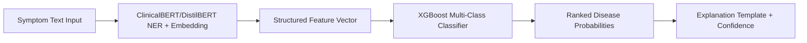
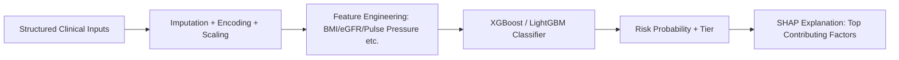
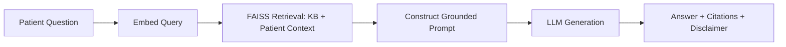

# MedAssist AI — AI Pipeline Documentation

Each AI module below follows the same lifecycle: **Dataset → Preprocessing → Feature Engineering → Model Selection → Training → Evaluation → Inference → Deployment → Monitoring**, with model choices justified. All modules are deployed as independent services behind the AI Gateway (see `ai_apis` backend module) so they can be retrained/redeployed without affecting the rest of the platform.

---

## 1. Symptom Checker

| Stage | Details |
|---|---|
| Dataset | Public symptom-disease datasets (e.g., DDXPlus, symptom-disease Kaggle sets), curated with clinician review; supplemented with synthetic symptom phrasing variations |
| Preprocessing | Text normalization (lowercasing, spelling correction), medical entity recognition to map free text to canonical symptom codes |
| Feature Engineering | Symptom-to-embedding via ClinicalBERT/DistilBERT; structured features: symptom count, duration, severity flags |
| Model Selection | **ClinicalBERT** (or DistilBERT for latency-sensitive inference) for symptom-text understanding + entity extraction, feeding into **XGBoost** multi-class classifier over canonical symptom-sets for disease ranking |
| Training | Fine-tune transformer on labeled symptom→disease pairs; train XGBoost on structured symptom vectors with disease labels; stratified k-fold cross-validation |
| Evaluation | Top-3 accuracy, macro-F1 across disease classes, calibration curve for confidence scores |
| Inference | Text → ClinicalBERT embedding/NER → structured feature vector → XGBoost → ranked disease probabilities → explanation template |
| Deployment | Containerized FastAPI inference service; DistilBERT variant for mobile-latency SLAs, ClinicalBERT for higher-accuracy web/doctor use cases |
| Monitoring | Track prediction confidence distribution, escalation rate to doctor, user feedback ("was this helpful?") loop for retraining data |
| Why these algorithms | ClinicalBERT is pretrained on clinical text (MIMIC-III), giving strong out-of-box medical language understanding; XGBoost adds a fast, interpretable (via SHAP) ranking layer over structured features without the latency cost of running a full generative model per request |

---

## 2. Disease Prediction (Diabetes / Heart Disease / Stroke / Kidney Disease)

Each disease has its own model, dataset, and evaluation, but shares the same pipeline pattern — implemented as 4 sibling modules under `ai-services/`.

| Stage | Details |
|---|---|
| Dataset | Diabetes: Pima Indians Diabetes dataset (+ supplementary clinical data); Heart: UCI Heart Disease / Cleveland dataset; Stroke: Kaggle Stroke Prediction dataset; Kidney: UCI CKD dataset. All augmented with de-identified partner clinical data where available |
| Preprocessing | Missing value imputation (median/mode or model-based, e.g. MICE), outlier capping, categorical encoding (one-hot/ordinal), class balancing (SMOTE) for imbalanced positive classes |
| Feature Engineering | Domain-derived features (e.g. BMI from height/weight, pulse pressure from systolic/diastolic BP, eGFR from creatinine/age/gender for kidney), interaction terms guided by clinical literature |
| Model Selection | **Random Forest** (baseline, interpretable), **XGBoost** (primary — best accuracy/latency tradeoff on tabular clinical data), **LightGBM** (used where dataset is large/high-dimensional, faster training) |
| Training | Stratified train/val/test split (70/15/15), hyperparameter tuning via Optuna/GridSearch, class-weighted loss for imbalance |
| Evaluation | AUC-ROC (primary metric), sensitivity/recall (prioritized — false negatives are clinically costlier than false positives), precision, F1, confusion matrix, SHAP feature-importance for explainability |
| Inference | Structured clinical inputs → preprocessing pipeline (same transforms as training, versioned together) → model → probability + risk tier (low/medium/high) + top contributing factors via SHAP |
| Deployment | Each disease model served as its own inference endpoint under `model_serving/`, versioned in `AI_MODELS` table; canary rollout for new model versions |
| Monitoring | Population Stability Index (PSI) for input drift, rolling AUC on labeled feedback (where ground truth later becomes available e.g. confirmed diagnosis), alerting on drift threshold breach |
| Why these algorithms | Gradient-boosted trees (XGBoost/LightGBM) consistently outperform linear/simple models on structured clinical tabular data with non-linear feature interactions, while remaining explainable via SHAP — a requirement given these are health-risk predictions shown directly to patients and doctors. Random Forest is retained as a robust, lower-variance baseline for comparison and sanity-checking. |

---

## 3. Medical Report OCR

| Stage | Details |
|---|---|
| Dataset | Labeled lab report images/PDFs (synthetic + de-identified real samples) covering common formats (CBC, lipid panel, metabolic panel) |
| Preprocessing | Image deskew/denoise, PDF-to-image rasterization, contrast normalization |
| Feature Engineering | N/A (end-to-end OCR); post-OCR regex/rule-based field mapping to canonical lab test names and units |
| Model Selection | **PaddleOCR** (detection + recognition pipeline) — chosen for strong multilingual support, good accuracy on structured/tabular documents, and open-source licensing suitable for on-prem/self-hosted deployment (important for PHI data residency) |
| Training | Primarily uses pretrained PaddleOCR detection/recognition models; fine-tuning on a curated lab-report-specific dataset if accuracy on target formats is insufficient |
| Evaluation | Character Error Rate (CER), field-level extraction accuracy against ground-truth labeled reports, table-structure parsing accuracy |
| Inference | Image/PDF → text-region detection → text recognition → post-processing rules mapping raw text to structured `{ test_name, value, unit, reference_range }` |
| Deployment | GPU-backed inference service (batch-friendly) behind async job queue since OCR is not always sub-second |
| Monitoring | Track extraction confidence per field, manual-correction rate (proxy for real-world accuracy), format-coverage gaps (new report layouts not well handled) |
| Why this algorithm | PaddleOCR provides a strong, actively maintained, self-hostable OCR pipeline avoiding third-party cloud OCR API dependency for sensitive medical documents — critical for data residency/compliance |

---

## 4. Medical Report Analyzer

| Stage | Details |
|---|---|
| Dataset | Reference range tables per lab test (clinically sourced), historical analyzed-report corpus for summary-generation fine-tuning |
| Preprocessing | Normalize extracted OCR fields to canonical units (e.g., mg/dL vs mmol/L conversion) |
| Feature Engineering | Flag values outside reference range; compute delta from patient's historical values (trend detection) |
| Model Selection | Rule-based abnormal-value detection (deterministic, auditable) + **Hugging Face NLP model** (fine-tuned summarization/text-generation, e.g. a T5/BART-family model) for generating patient-friendly explanations of abnormal values |
| Training | Fine-tune the summarization model on (structured findings → plain-language explanation) pairs authored/reviewed by clinicians |
| Evaluation | ROUGE/BLEU for summary quality (proxy metric) + mandatory clinician review sign-off before production use; factual-consistency checks against the rule-based flags (no LLM output should contradict deterministic thresholds) |
| Inference | OCR output → reference-range rule engine (deterministic abnormal flagging) → LLM generates plain-language summary + suggested next steps, constrained/grounded by the rule-engine output |
| Deployment | Stateless inference service; rule engine and LLM versioned and deployed together to keep explanations consistent with flags |
| Monitoring | Track summary length/readability score, rate of user-reported confusing summaries, drift in reference-range rule coverage as new report types are onboarded |
| Why this approach | Combining deterministic rules (for the clinically critical "is this abnormal" decision) with an LLM (for natural-language explanation only) keeps the clinically consequential logic auditable and testable, while still giving patients an approachable summary — avoiding a fully black-box LLM making the abnormal/normal call itself |

---

## 5. AI Health Chatbot

| Stage | Details |
|---|---|
| Dataset | Curated medical knowledge base (trusted sources: clinical guidelines, drug information, general health FAQs), plus the patient's own report/prediction history as retrievable context |
| Preprocessing | Document chunking, cleaning, metadata tagging (source, date, category) for the knowledge base |
| Feature Engineering | Embedding generation via a Hugging Face sentence-embedding model for both knowledge base chunks and patient context |
| Model Selection | **RAG (Retrieval-Augmented Generation)** architecture: **FAISS** vector store for retrieval + a Hugging Face-hosted LLM for generation — chosen over a pure fine-tuned LLM because RAG keeps medical knowledge updatable without retraining, and grounds answers in retrievable, citable sources (reduces hallucination risk) |
| Training | No end-to-end training of the LLM itself (uses a capable pretrained/instruction-tuned model); "training" here = building/maintaining the FAISS index and prompt-template engineering |
| Evaluation | Retrieval precision/recall@k, answer groundedness (does the answer align with retrieved sources), human evaluation for medical safety/appropriateness, refusal-rate on out-of-scope diagnostic questions |
| Inference | Question → embed → FAISS top-k retrieval (knowledge base + relevant patient history) → prompt LLM with retrieved context → generate grounded answer + source citations + safety disclaimer |
| Deployment | Vector index refreshed on a scheduled job as knowledge base updates; LLM served via managed inference or self-hosted Hugging Face endpoint depending on data-sensitivity requirements |
| Monitoring | Log all Q&A pairs (with consent) for safety review, track escalation-to-doctor rate, monitor for prompt-injection / out-of-scope medical advice attempts |
| Why this approach | RAG lets the chatbot answer from an auditable, continuously-updatable knowledge base rather than the LLM's opaque internal knowledge, which is essential for a healthcare context where citing the source of medical information matters for trust and safety |

---

## 6. Recommendation Engine (Diet & Exercise)

| Stage | Details |
|---|---|
| Dataset | Nutrition/exercise guideline datasets mapped to health conditions, patient profile data (age, BMI, disease history) |
| Preprocessing | Normalize patient profile features; encode disease/condition flags |
| Feature Engineering | Similarity feature vector per patient (age bucket, BMI category, condition set, activity level) |
| Model Selection | Hybrid: **rule-based guideline mapping** (condition → contraindicated foods/exercises, clinically authored) + **content-based similarity via FAISS** to surface personalized plan variants from a curated plan library based on nearest-neighbor patient profiles |
| Training | No classical "training" — the FAISS index is built over the curated plan library's feature vectors; rules are clinician-authored and versioned |
| Evaluation | Coverage (% patients receiving a plan without fallback default), clinician review of a sample of generated plans for safety/appropriateness |
| Inference | Patient profile → feature vector → rule-engine filters unsafe options (contraindications) → FAISS nearest-neighbor plan retrieval from the filtered set → personalized plan returned |
| Deployment | Lightweight, low-latency service (no GPU required) |
| Monitoring | Track plan adherence signals (if patient marks a plan as followed), feedback ratings, contraindication-rule coverage gaps |
| Why this approach | A hybrid rule + retrieval system guarantees clinically-vetted safety constraints are always respected (rules can't be "overridden" by a model), while still providing personalization via similarity search — avoids the risk of a purely generative recommender suggesting something contraindicated for a patient's condition |

---

## 7. Health Risk Score

| Stage | Details |
|---|---|
| Dataset | Aggregated outputs of the individual disease-prediction models + demographic/lifestyle inputs |
| Preprocessing | Normalize each component risk probability to a common 0–100 scale |
| Feature Engineering | Weighted composite score across cardiac/metabolic/renal component scores; weights derived from clinical literature on relative risk severity, tunable per admin configuration |
| Model Selection | **Weighted ensemble aggregation** of existing disease-prediction model outputs (not a new model trained from scratch) — a meta-layer over `diabetes`, `heart_disease`, `stroke`, `kidney_disease` model outputs |
| Training | Weight calibration via clinician-reviewed rubric; optionally refined via logistic regression against longitudinal outcome data as it becomes available |
| Evaluation | Correlation of score trend with actual outcome events (where available), stability of score across repeated near-identical inputs |
| Inference | Fetch latest per-disease predictions for the patient → apply weighted aggregation → overall score + component breakdown + trend vs. previous score |
| Deployment | Lightweight aggregation service; depends on the individual disease-prediction services being available (graceful degradation if one is unavailable — score computed on available components with a caveat) |
| Monitoring | Track score volatility, component-availability rate, correlation with clinician-assessed risk during doctor review |
| Why this approach | Reusing the existing validated disease models as inputs (rather than training a separate end-to-end risk model) keeps the score consistent with, and explainable in terms of, the individual predictions patients/doctors already see elsewhere in the app |

---

## 8. Shared AI Infrastructure Notes

- **Model Registry** (`ai-services/shared/model_registry.py` + `AI_MODELS` table): every deployed model version is registered with metadata (training date, dataset version, metrics) for full traceability.
- **Feature Store**: shared preprocessing/feature computation logic reused across disease-prediction modules (e.g., BMI calculation) to avoid inconsistent feature definitions across models.
- **Monitoring**: all modules emit standardized metrics (latency, request volume, error rate, confidence distribution) to a central monitoring dashboard consumed by the Admin AI Monitoring screen.
- **Human-in-the-loop**: All AI outputs are labeled as advisory in the UI; high-risk predictions (e.g. "high" stroke/heart risk tier) trigger a recommended doctor-escalation flow rather than being presented as a final answer.
