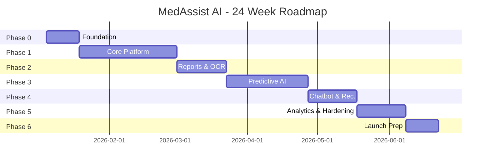

# MedAssist AI — Development Roadmap

Assumes a cross-functional team: 2 backend engineers, 2 AI/ML engineers, 1 Flutter engineer, 1 React engineer, 1 DevOps engineer, 1 QA, 1 PM/architect. Timeline: ~24 weeks (6 months) to v1 production launch, organized into 6 phases / 12 two-week sprints.

---

## Phase 0 — Foundation (Weeks 1–2 / Sprint 1)

| Week | Focus |
|---|---|
| 1 | Repo setup (monorepo structure per Folder Structure doc), CI/CD skeleton (GitHub Actions), Docker Compose base, environment config strategy, cloud account/infra setup |
| 2 | Database schema implementation (migrations for core tables), auth module (register/login/JWT), base FastAPI app skeleton with core/db layers |

**Milestone:** Local dev environment fully bootstrapped; `docker-compose up` runs backend + Postgres + Redis with working `/auth` endpoints.

---

## Phase 1 — Core Platform (Weeks 3–8 / Sprints 2–4)

| Week | Focus |
|---|---|
| 3–4 | Backend modules: users, patients, doctors, appointments, file_upload, notifications, settings |
| 5–6 | Flutter app: authentication, dashboard, home, profile, settings, notifications features (UI + integration with backend) |
| 7–8 | React dashboard: doctor-dashboard, admin-dashboard shells, patients, doctors, appointments modules; RBAC-protected routing |

**Milestone:** End-to-end account creation → login → profile management works across mobile, backend, and web; doctor can view an assigned patient list; admin can manage users.

---

## Phase 2 — Medical Reports & OCR (Weeks 9–11 / Sprint 5–6a)

| Week | Focus |
|---|---|
| 9 | Backend: medical_reports module, S3/object storage integration, async job queue setup |
| 10 | AI: `medical_report_ocr` module — dataset prep, PaddleOCR integration, evaluation against labeled samples |
| 11 | AI: `medical_report_analyzer` module (rule engine + summarization); Flutter/React report upload & view screens |

**Milestone:** Patient can upload a report, see OCR-extracted values and a plain-language AI summary in the mobile app; doctor can view the same in the dashboard.

---

## Phase 3 — Predictive AI Modules (Weeks 12–16 / Sprints 6b–8)

| Week | Focus |
|---|---|
| 12 | `symptom_checker` module: dataset curation, ClinicalBERT/DistilBERT + XGBoost pipeline, evaluation |
| 13 | `diabetes_prediction` + `heart_disease_prediction` modules: data prep, model training, evaluation, inference service |
| 14 | `stroke_prediction` + `kidney_disease_prediction` modules: same pipeline pattern |
| 15 | `health_risk_score` module (aggregation layer over disease models); AI Gateway (`ai_apis`) integration for all prediction endpoints |
| 16 | Flutter/React integration for symptom checker, disease prediction, and risk score screens; doctor-facing views of AI outputs |

**Milestone:** All disease-prediction and symptom-checker modules deployed and callable end-to-end from both apps; risk score visible on patient dashboard.

---

## Phase 4 — Chatbot, Recommendations & Prescriptions (Weeks 17–19 / Sprint 9)

| Week | Focus |
|---|---|
| 17 | `ai_health_chatbot` module: knowledge base curation, FAISS index build, RAG pipeline, chat backend module |
| 18 | `diet_recommendation` + `exercise_recommendation` modules; `prescriptions` backend module + doctor UI |
| 19 | Flutter chatbot UI + recommendation screens; medicine reminders feature |

**Milestone:** Patient can chat with the AI assistant, receive diet/exercise plans, and see doctor-issued prescriptions; reminders functioning end-to-end.

---

## Phase 5 — Analytics, Hardening & QA (Weeks 20–22 / Sprint 10–11a)

| Week | Focus |
|---|---|
| 20 | `analytics` backend module + admin analytics/AI-monitoring dashboards; centralized logging/monitoring setup |
| 21 | Security hardening pass (per Security Architecture doc): pen-test remediation, audit logging completeness, rate-limiting tuning |
| 22 | Full regression QA pass across mobile/web/backend/AI; performance/load testing against NFR targets |

**Milestone:** Admin has full visibility into platform + AI health; security review sign-off; NFR targets (latency, uptime readiness) validated under load.

---

## Phase 6 — Launch Preparation (Weeks 23–24 / Sprint 11b–12)

| Week | Focus |
|---|---|
| 23 | Production environment provisioning (Terraform/AWS), production data migration dry-run, final UAT with pilot doctors/patients |
| 24 | Go-live: production deployment, monitoring/alerting validation, post-launch support rotation established |

**Milestone:** v1 production launch.

---

## Sprint Cadence Summary

## Cross-Cutting Workstreams (run continuously across all phases)

- **QA**: test cases written alongside each module in the same sprint it's built (not deferred to Phase 5).
- **DevOps**: CI/CD pipeline expanded incrementally per module as it's added; infra-as-code kept in sync with each phase's deployed components.
- **AI Monitoring**: model registry and monitoring hooks (`shared/model_registry.py`, `shared/monitoring/`) built once in Phase 0/1 and reused by every AI module as it ships.
- **Documentation**: this documentation set is treated as a living artifact — updated as part of the Definition of Done for each sprint.
