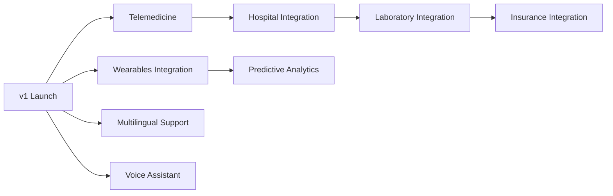

# MedAssist AI — Future Enhancements

Enhancements beyond v1, prioritized by expected impact and dependency ordering. None of these are required for the v1 launch scope defined in the SRS.

---

## 1. Wearables Integration

- Ingest data from Apple Health, Google Fit, Fitbit, and other wearables (heart rate, sleep, step count, SpO2).
- Feeds directly into `health_risk_score` and `disease_prediction` models as additional real-time features, improving prediction recency and accuracy over point-in-time clinical inputs alone.
- Requires: new `wearables` backend module, OAuth integrations per provider, a streaming/near-real-time ingestion pipeline (vs. today's request/response pattern).

## 2. Voice Assistant

- Voice-based interaction for the Symptom Checker and AI Health Chatbot, targeting accessibility (elderly/low-literacy users) and hands-free use.
- Requires speech-to-text and text-to-speech integration layered on top of the existing chatbot/symptom-checker pipelines — the underlying NLP/RAG logic is reused, only the input/output modality changes.

## 3. Multilingual Support

- Localize Flutter and React UIs; extend NLP models (symptom checker, chatbot, report analyzer) to support additional languages via multilingual transformer models or translation-layer wrapping.
- Requires careful clinical review per language to ensure medical terminology translation accuracy — not a purely technical localization effort.

## 4. Hospital Integration

- HL7/FHIR-based interoperability to exchange patient records with partner hospital EHR systems.
- Enables doctors to view external hospital records alongside MedAssist-native data, and supports referral workflows.
- Requires a dedicated `integrations/hl7-fhir` service and significant compliance/data-governance work per hospital partner.

## 5. Laboratory Integration

- Direct electronic result feeds from partner labs (replacing/supplementing manual report upload + OCR for those labs).
- Improves data accuracy versus OCR extraction and reduces patient friction.

## 6. Insurance Integration

- Enable insurance-provider entities to verify coverage, process claims, or receive (consented) risk-score data for underwriting-adjacent use cases.
- Highest sensitivity item on this list from a privacy/regulatory standpoint — requires explicit, granular patient consent flows and separate legal review before any implementation work begins.

## 7. Predictive Analytics (Population Health)

- Aggregate, de-identified analytics for admins/hospital partners: disease-prevalence trends, at-risk population segmentation, early-warning signals across the user base.
- Builds on the existing `analytics` module and `AI_PREDICTIONS` data, adding a dedicated population-level analytics pipeline (distinct from individual patient predictions).

## 8. Telemedicine (Video Consultation)

- In-app video/audio consultation between patient and doctor, integrated with the existing `appointments` and `prescriptions` modules.
- Requires WebRTC infrastructure or a managed video SDK, plus recording/consent and clinical documentation workflows.

---

## Suggested Prioritization (post-v1)

**Rationale for ordering:** Telemedicine and Wearables directly extend the core patient/doctor loop already built in v1 and have the clearest immediate user value. Hospital/Laboratory integrations are higher-effort, partner-dependent, and best pursued once the core platform has a proven user base to justify the integration investment. Insurance integration is placed last given its elevated regulatory/consent complexity relative to its direct product value.
